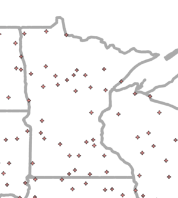
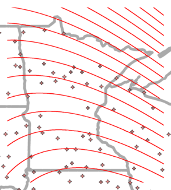
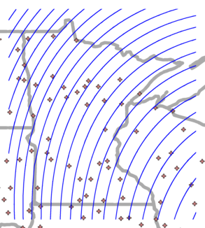
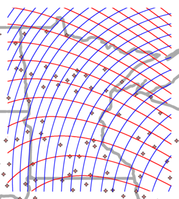
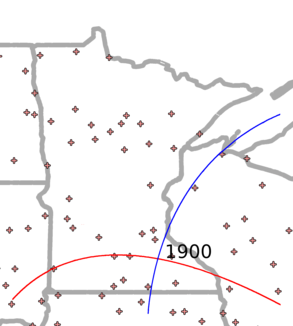
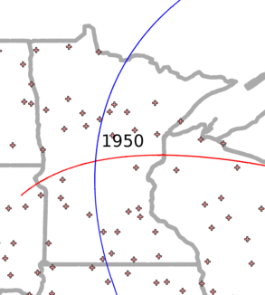
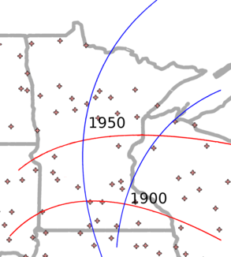
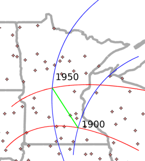
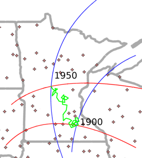
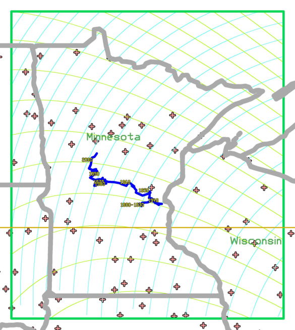

climate_tracker
===============

Simple climate model using surface fitting and velocity measurements.

Pictorial Explanation
=====================

The process begins by looking at data from all the weather stations. There are about 1200 of these in the U.S. and 33 in Minnesota. Some stations' records date back as far as 1850, but the majority of the data are for 1900 onwards. Data are kept in the form of monthly averages and totals.

Each station keeps track of its average temperature every month. From these, we find yearly averages.

For a given year, we average the previous 30 years together; the result is the temperature of the station's climate for that year.

Using these known values, we can mathematically calculate the temperature of any other point on the map. If you were to draw curves between the points that have the same temperatures, it might look like this.

Each station also keeps track of its total precipitation for each month. From these, we find yearly totals.

For a given year, we average the previous 30 years together; the result is the precipitation of the station's climate for that year.

Using these known values, we can mathematically calculate the precipitation of any other point on the map. If you were to draw curves between the points that have the same precipitation, it might look like this.

Now, we can overlay the precipitation and temperature curves on top of each other and find their intersections. Each intersection defines a climatic point&mdash;a specific combination of temperature and rainfall more or less hospitable to any given ecosystem.

Now, let's make a few of the temperature and precipitation lines disappear.

The intersection of the remaining lines is a climatic point. It shows where a particular combination of temperature and precipitation (let's say 52&deg;F and 7" of rain) is in the year 1900.

We can figure out where that same climatic point is in 1950. (This isn't real data, it's just an example.)

Now, if we know where the climate was in both 1900 and 1950, we can begin to track its movement...

...by connecting the dots&mdash;in this case, climatic points.

Of course, connecting the dots between 1900 and 1950 doesn't say very much about where the climate has gone, so we connect each year's dot with the dot of the following year.

Remember, this isn't real data: it's an example.

The new path connects every year and doesn't look as nice, but tells a more interesting story.

 * From 1900&ndash;1920, we see that the climate hovered in the same place. No two years' weather is the same, so the climate was always moving, but not very far: it was moving in circles.
 * From 1920&ndash;1930, the climate moved north and west. Some years it moved a lot, other years a little. During some years, it even reversed direction, but the general trend was north and west.
 * After a little more hovering and moving the climate arrived at its 1950 location.
 * This means that the climate of 1900 has moved to a new location by 1950, displacing whatever climate was there before.

Some Real Data
==============

Now, let's look at some real data; this is the story of one of Minnesota's climate points.

Our data for the point, located in south-east Minnesota, begins in 1900. Thirty years later, we have enough data to calculate the point's climate. At this time, in 1930, the Dust Bowl was just beginning and the point moved steadily eastward as a result of this change in climate. By the time the Dust Bowl ended, the point had touched the Wisconsin border, north of Taylors Falls. Had it stayed there, Minnesota would eventually have had only prairies, not forests.

But in just a single year it abruptly turned 180 degrees, retracing part of its path and beginning thirty-year northwestward journey toward the Dakota border, south of Fargo. Had it continued moving in this direction, Minnesota would eventually have had only forests and no prairies. But, instead, it stalled out and hovered in the middle of the state, southwest of Brainard.

In the last twenty years it has again abruptly changed direction, turning 90 degrees north and heading in the direction of the pine stands of Itasca.
