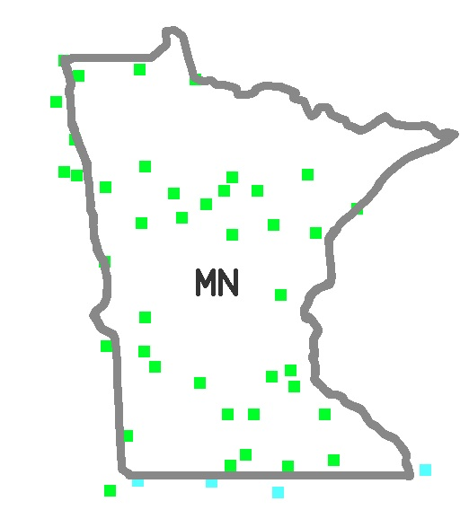

USHCN Stations
==============
Stations east of the 100th meridian. Overlaps ~80 stations with those west of the meridian.
[Link](regions/ushcn_east100.txt)

Stations west of the 100th meridian. Overlaps ~80 stations with those east of the meridian.
[Link](regions/ushcn_west100.txt)

Minnesota and surrounding stations
[Link](regions/ushcn_mnplus.txt)

