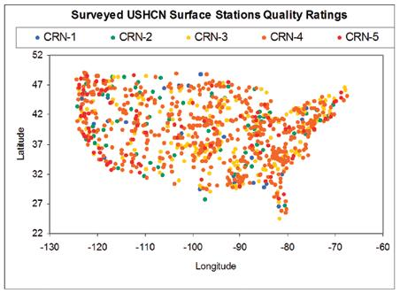

Data Sources
============
USHCN (Usefully long, some quality concerns)
--------------------------------------------
Offers:

 * PRCP = precipitation (hundredths of inches)
 * SNOW = snowfall (tenths of inches)
 * SNWD = snow depth (inches)
 * TMAX = maximum temperature (degrees F)
 * TMIN = minimum temperature (degrees F)

Network of 1218 stations throughout the US. This does not mean that there is a continuous record of data from all the stations, that all stations are still active, or that all stations began taking data at the same time.

Data ranged (at the time I looked at it) from 1849-2009.

There are serious questions regarding the quality of the stations and the data they produce. These are summed up in [this](ext_doc/surfacestationsreport_spring09.pdf) report from [SurfaceStations.org](http://www.surfacestations.org), which found endemic inconsistencies in station placement and maintenance. Changes in the paint on the stations, placement of electronics within the enclosure, placement of the station too close to buildings, heat sources, or parking lots were all cited as problems with the stations. With 70% (865 of 1221) of the network surveyed, only 11% of the stations were considered to be of quality. A map of station quality follows.

Some example pictures of MN stations:

Quality ratings and definitions were taken from the USCRN Network's [Site Information Handbook](http://www1.ncdc.noaa.gov/pub/data/uscrn/documentation/program/X030FullDocumentD0.pdf). [Menne et al 2009](http://www1.ncdc.noaa.gov/pub/data/ushcn/v2/monthly/menne-etal2009.pdf) states that:

> the collective effect of changes in observation practice at USHCN stations is of the same order of magnitude as the background climate signal.

[Menne et al 2010](http://www1.ncdc.noaa.gov/pub/data/ushcn/v2/monthly/menne-etal2010.pdf) states that:

> the adjusted USHCN temperatures are extremely well aligned with recent measurements from instruments whose exposure characteristics meet the highest standards for climate monitoring. In summary, we find no evidence that the CONUS average temperature trends are inflated due to poor station siting.

Additionally, changes to the data are not always well-documented and the source code for adjusting the data is not publically available. Although a [software directory](http://www1.ncdc.noaa.gov/pub/data/ushcn/v2/monthly/software/) became available on 19th February 2010. Some discussion of the USHCN's by GISS can be found at [Steve McIntyre's blog](http://climateaudit.org/2007/08/11/does-hansens-error-matter/).

Reports have been published countering the above and indicating that the record is still an accurate representation of climate.

There may somewhere be a document detailing each station's history, but I'm not sure where this may be. (Todo)

Data availability varied over time. If we consider the percentage of points available in a given year versus the number of points which would have been available if the full network including all historically-available was online, the following graphs (which originate from [this code](ushcn_daily_data_quality.c]) result.

**MN**

**Entire US**

Choosing a period from 1900-Present we can ask the question, "How many stations are there with fewer than X missing points for each month of each year of this time period?" We can answer this question using [this code](stations_with_less_than_days_per_month_missing.cpp). This results in [this data](other/ushcn_daily_missing_US_1950-2009) and this picture for the whole US:

For the state of Minnesota [this data](ushcn_daily_missing_MN_1950-2009) results, along with this picture:

Another way of displaying this data is with months since the beginning of time (~1831) on the x-axis, stations on the y-axis, and availability on the z-axis, with white representing all data available. [This code](ushcn_daily_available_by_month_picture.c) will produce the data for this. You process as follows:

<pre>
./a.out -s station_data -L 1900 -d ../data/ushcn_daily/us_daily.txt
csplit swdpmm.dat '/###/' {*}
cat xx01 | sort -n | sed '1,2d' > zding
gnuplot
#set xrange [0:1932]; set yrange [0:1221]
set cbrange [0:100]
set yrange [0:1218]
set pm3d map corners2color c1
set palette rgbformulae 23,28,3
set terminal png size 600, 300
set output 'us_tmax_pic.png'
set ylabel "Station"
set xlabel "Months Since January 1900"
set zlabel "Availability (white=100%)"
set title "Max Temp Data Availability in United States"
unset key
splot 'zding' matrix
</pre>

For the entire US this produces the following:

**TMax, Entire US, Months Since 1900**

**Prcp, Entire US, Months Since 1900**

**TMax, MN, Months Since 1900**

**Prcp, MN, Months Since 1900**

The above results are not unexpected. The USHCN's site states:

> The start date for stations in the USHCN vary so that the stations used to compute the national value may change from year to year, especially for the earliest years. At present, ancillary variables are not available in the USHCN. Information for geographical sub-regions such as climate regions, river basins, and agricultural regions are currently not available, although they could be computed eventually. Data for the USHCN are not available in near real-time status.

USCRN (High-quality, but not yet useful)
----------------------------------------
The US Climate Reference Network ([USCRN](http://www.ncdc.noaa.gov/crn/)) consists of 114 NOAA-maintained stations.

The site states:

> One of the principal conclusions of the 1997 Conference on the World Climate Research Programme was that the global capacity to observe the Earth's climate system is inadequate and deteriorating worldwide and "without action to reverse this decline and develop the GCOS, the ability to characterize climate change and variations over the next 25 years will be even less than during the past quarter century" ( National Research Council [NRC] 1999). In spite of the United States being a leader in climate research, we do not have, in fact, an observing network capable of ensuring long-term climate records free of time-dependent biases. Even small biases can alter the interpretation of decadal climate variability and change.

Another quote:

> Over the last decade, the amount of money in our economy that is directly impacted by the reliability of NOAA’s climate data has increased dramatically. Errors in the data which might not have mattered a decade ago can now cost individuals and corporations millions of dollars. With our existing network, these errors are guaranteed to occur. However, the Climate Reference Network would be able to provide these sectors of the economy with reliable data

Performance of the system is measured against 4000 US Coop stations (todo: where do we get this data?) to see how they correlate. It is unclear to me (todo) what value might be derived from this statistic since the point of the USCRN is to be a higher-quality observation network than the US Coop.

Since the network had only 2 stations in 2000 (and ~203 by 2011), the data set is probably not yet useful for this study.

USHCN-M (High-quality, but not yet useful)
------------------------------------------

U.S. Historical Climatology Network - Modernization (USHCN-M) will maintain the same quality as the USCRN, but be spaced more closely, and focus solely on temperature and precipitation. The USHCN-M stations will be deployed at a 100km spatial resolution to provide for the detection of regional climate change signals. Following completion of the pilot project, the long-term vision is deployment in each of the nine NOAA climate regions of the United States at a 100 km spatial resolution that will allow the detection of regional climate change signals. About 1000 locations in the United States will have either a USHCN-M or USCRN station at the end of deployment for this project.

GSOD (Unevaluated)
------------------

Offers: 
<pre>
STN---,WBAN , YEARMODA,   TEMP,  ,   DEWP,  ,  SLP  ,  ,  STP  ,  , VISIB,  ,  WDSP,  , MXSPD,  GUST,   MAX  ,  MIN  ,PRCP  ,SNDP , FRSHTT,
</pre>

[Link](http://lwf.ncdc.noaa.gov/cgi-bin/res40.pl?page=gsod.html)

Includes some Canadian stations:

**All of Canada**

**Manitoba/Ontario Around Northern Minnesota**

Graphs made with:
<pre>
#All Canadian Stations
cat ish-history.csv  | cut -d ',' -f 1,2,4,5 | sed 's/"//g'| grep "CN,CA" | cut -d ',' -f 1,2 | sed 's/,/-/' > canadian_stations

#Manitoba/Ontario Stations around MN
#The long numbers in awk are latitude (1st one) and longitude (2nd two) in thousandths of degrees
cat ish-history.csv  | cut -d ',' -f 1,2,4,5,8,9 | sed 's/["+]//g'| grep "CN,CA" | sed 's/,/ /g' | awk '{if ($5<50281 && $6>-98020 && $6<-88308) print }' | cut -d ',' -f 1,2 | sed 's/,/-/' | cut -d ' ' -f 1,2 | sed 's/ /-/' > canada_manitoba

#Extract all files from gsod tars
for a in `ls -1 *.tar`; do tar -tvf $a; done > tar_contents

#See station availability by year
cat tar_contents | sed 's/  */ /g' | cut -d ' ' -f 6 | grep gz | sed 's/[a-z.\/]//g' | grep -f canada_manitoba | cut -d '-' -f 3 | sort | uniq -c > manitoba_count
</pre>

[Global Historic Climate Network](http://www.ncdc.noaa.gov/ghcnm/)
------------------------------------------------------------------
The Global Historical Climatology Network (GHCN-Monthly) data base contains historical temperature, precipitation, and pressure data for thousands of land stations worldwide. The period of record varies from station to station, with several thousand extending back to 1950 and several hundred being updated monthly via CLIMAT reports. The data are available without charge through NCDC's anonymous FTP service.

Includes some Canadian stations:

**All of Canada**

VEMAP2 Gridded Record
---------------------
The VEMAP Phase 2 historical gridded record (1895-1993) provides the most spatially comprehensive information about minimum and maximum temperature, precipitation, solar radiation (and irradiance), and vapor pressure (relative humidity). The VEMAP record is based on data from NOAA's National Climatic Data Center's U.S. Historical Climate Network (HCN) and other cooperative network stations, plus the USDA-Natural Resources Conservation Service (NRCS) SnoTel stations for high elevation precipitation. Data from 8000 stations were statistically in-filled to create continuous records. These were then spatially interpolated to a 0.5 deg lat/log grid, accounting for elevation and rainshadow effects, using the PRISM model (Chris Daly, OSU and Tim Kittel, NCAR). There are both monthly and daily versions. Daily fields are generated from monthly fields using a stochastic weather generator. Grid point daily data are not spatially auto-correlated at the daily timestep (i.e. daily events are not synchronous in adjacent grid cells), but are resolved on the VEMAP 0.5� x 0.5� grid, a finer resolution than the GCM data. [Link](http://www.cgd.ucar.edu/vemap/)

Climate Epochs Data Set
-----------------------
This data set, developed by NCDC, is used to identify adjacent periods with significant changes of temperature, precipitation, or both. The data set is useful for examining the effects of climate change using observed data. Periods are 10 year, 15 year, and 20 year epochs, done for each season and annual.

Nineteenth Century US Climate Data Set Project
----------------------------------------------
Monthly temperature and precipitation data from the 19th century, from published data that have been digitized by the Forts project. [Link](http://www.ncdc.noaa.gov/onlinedata/forts/forts.html)

Canadian Climate Data and Information Archive
---------------------------------------------
[Link](http://www.climate.weatheroffice.gc.ca/Welcome_e.html)

For those with a high speed Internet connection, the 2006/7 CDCD containing daily temperature, precipitation and snow-on-the-ground data is available for download. Data is available for the complete period of record for each location up to 2007. The file contains software that provides access to the data. [CDCD Link](ftp://arcdm20.tor.ec.gc.ca/pub/dist/CDCD/)

CDCD download does not appear to have accessible data. Data is in a binary format and download contains a program to read this, but provisions for bulk processing of the type we're doing do not seem to have been made.

Contains 7,815 locations with daily temperature, precipitation, and snow-on-the-ground data.

Temperatures are measured in a louvered box called a Stevenson screen, mounted 1.5 m above the ground, which is usually a level, grassy surface. At most ordinary stations the maximum temperature is the highest recorded in a 24-hour period ending in the morning of the next day.  The minimum values are for a period of the same length, beginning in the evening of the previous day.  Mean temperature is the average of the two.  At most principal stations the maximum and minimum temperatures are for a day beginning at 0600 Greenwich (or Universal) Mean Time, which is within a few hours of midnight local standard time in Canada.

Rain, drizzle, freezing rain, freezing drizzle and hail are usually measured using the standard Canadian rain gauge, a cylindrical container 40 cm high and 11.3 cm in diameter.  The precipitation is funnelled into a plastic graduate which serves as the measuring device.  Snowfall is the measured depth of newly fallen snow, measured using a snow ruler.  Measurements are made at several points which appear representative of the immediate area, and then averaged.  "Precipitation" in the tables is the water equivalent of all types of precipitation.

At most ordinary stations the water equivalent of snowfall is computed by dividing the measured amount by ten.  At principal stations it is usually determined by melting the snow that falls into Nipher gauges.  These are precipitation gauges designed to minimize turbulence around the orifice, and to be high enough above the ground to prevent most blowing snow from entering.  The amount of snow as determined by this method normally provides a more accurate estimate of precipitation than using the "ten-to-one" rule.

Precipitation measurements are usually made four times daily at principal stations.  At ordinary sites they are usually made once or twice per day.

The CDCD data is stored in a binary format. Software incldued in the package makes it possible to view individual stations, but not to do aggregate processing. To use the software, install "dosbox" on Linux. Then mount the directories as a CD-ROM using:
<pre>
mount d -t cdrom /PATH_TO_FILES
D:
CDCD.EXE
</pre>

The CDCD's **STATION.ALL** file can be decoded with [this code](cdcd_all_station_decode.c) code which is based on [this](ext_doc/cdcd_descriptor.doc) file descriptor sent to me in a personal communication from Caroline Barnes, Data Specialist at the Weather and Environmental Monitoring subdivision of the Meteorological Service of Canada.

The result of the above code can then be processed with this command:

    ./a.out STATIONS.ALL | cut -d ',' -f 3,4,6,7 | awk -F ',' '{if($1<5028 && $2<9802 && $2>8831) print}' | cut -d ',' -f 3,4 > yearsy

Which can then be processed with [this](ranged_histogram.py) ranged histogram code to produce the following graph of data availability over time.

**Ranged Histogram of Station Availability for Manitoba/Alberta**

Note that the above is based entirely on the start and end dates of data availability. There may be months, years, or decades missing in the middle.

US First Order Summary of the Day
---------------------------------
Contains some Canadian data

Governmental Exchange Data
--------------------------
Contains some Canadian data
