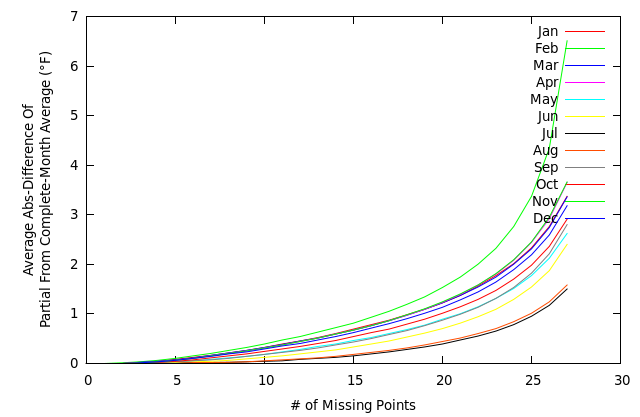
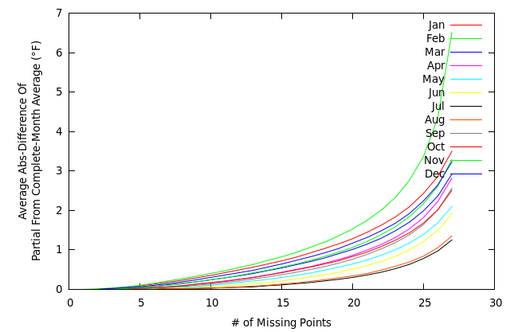
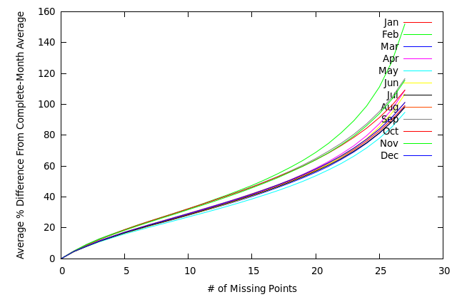
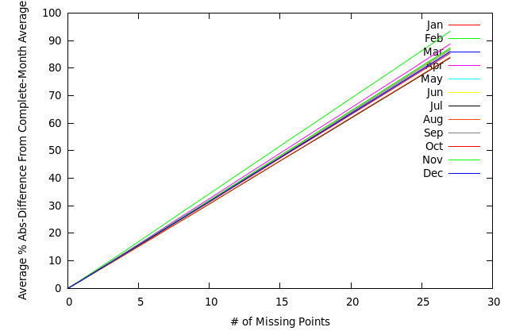
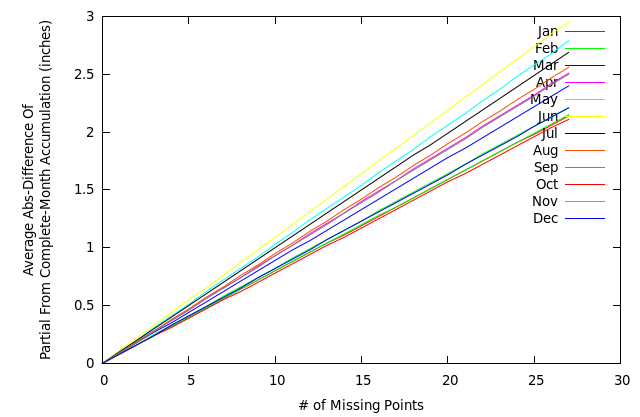
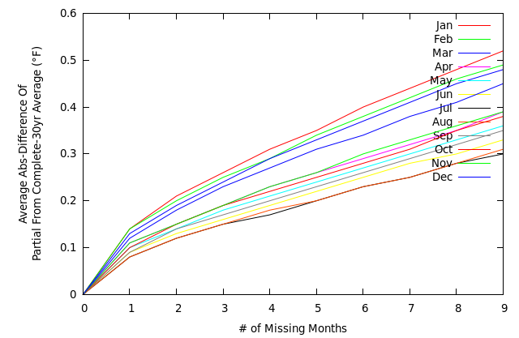
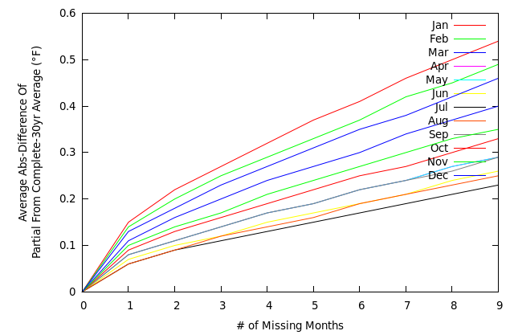
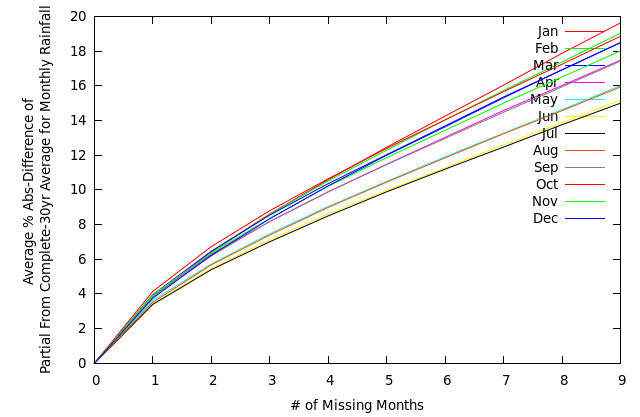
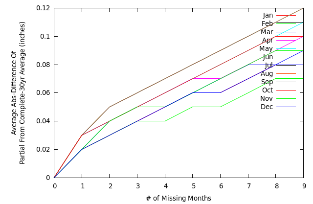

Monthly Admissibility
=====================
[This code](ushcn_daily_percent.c) performs this task.

The following graphs represent a relation between missing data points and their statiscal effect on average values for data elements. The graphs are formed by running through the us_daily data, culling incomplete months, and, for each month, shuffling the month's daily values using the Knuth-Fisher-Yates method.

From here, we define the Daily-Average as follows. The first X, X+1, X+2, &hellip; of points of the month are averaged (call this _DataMissing_) and then an absolute percent difference is found between the Xth averages and the average for the complete data set for the month (call this _DataComplete_). The resulting differences for each month (Jan, Feb, Mar, &hellip;) are then averaged over all available months (Jan, Feb, &hellip;) resulting in the following graphs. Specifically, the calculation performed on each month is

M=Abs(_DataComplete_-_DataMissing_)/_DataComplete_

M is then averaged over the number of months M was found for.

For temperature the percent difference isn't helpful as a 2&deg; variation is of equal importance (we assume) at 20&deg; as it is at 80&deg;. Therefore, we find the average absolute difference. This is found by averaging the first X, X+1, X+2, &hellip; points and then finding the absolute difference between these and the sum for the entire month. The resulting value is then averaged across the months we have data for.

For rainfall, we may sum the first X, X+1, X+2, &hellip; points and then find the absolute difference between these and the entire month as well as the percent difference (Monthly-Percent) between these and the entire month. The resulting value is then averaged across the months we have data for.

The following graphs everything:
<pre>
set xlabel "# of Missing Points"
set ylabel "Average Abs-Difference Of\nPartial From Complete-Month Accumulation (inches)"
#set ylabel "Average % Abs-Difference From Complete-Month Average"
plot "tmin" u 1:2 w lines t "Jan",
"tmin" u 1:3 w lines t "Feb",
"tmin" u 1:4 w lines t "Mar",
"tmin" u 1:5 w lines t "Apr",
"tmin" u 1:6 w lines t "May",
"tmin" u 1:7 w lines t "Jun",
"tmin" u 1:8 w lines t "Jul",
"tmin" u 1:9 w lines t "Aug",
"tmin" u 1:10 w lines t "Sep",
"tmin" u 1:11 w lines t "Oct",
"tmin" u 1:12 w lines t "Nov",
"tmin" u 1:13 w lines t "Dec"
</pre>

As expected, the graphs show that missing days cause a much larger difference for percipitation data versus temperature data. Tmin and Tmax track each other closely.

Specifically, 5 missing data points causes a 0.1&deg;F Tmax error, 0.1&deg;F Tmin error, and 0.4in (15%) Prcp error.

**Tmax**

**Tmin**

**Prcp (Daily-Average)**

**Prcp (Monthly-Average)**

**Prcp (Total Accumulation Difference)**

Climate Period Admissibility
============================
[This code](ushcn_monthly_percent.c) performs this task.

A climate period (a 30-year average) is considered admissible for a given station if is true that there a sufficient number of months (Jan, Feb, Mar, &hellip;) with a sufficient number of days. More concretely, let us say that a month is only admissible if fewer than 6 days are missing; let us also say that a climate period may only be missing three months. Then, if we have 27 Januarys, 27 Februarys, &c. the period is admissible. A July cannot make up for a lost January.

What then is the effect of a missing month in a climate period?

We find the daily average temperature for a month and then compare the 27-year, 28-year, &hellip; averages of these against the 30-year average.

We find the total precipitation accumulation for a month (with prorating) and then compare the 27-year, 28-year, &hellip; averages of these against the 30-year average.

**Tmax (Daily Average)**

**Tmin (Daily Average)**

**Prcp (Percentage)**

**Prcp (Accumulation)**

Climate Period Admissibility
============================

The follow charts show the percent of climate periods which are admissible for a given day/month cut-off definition (fewer than X days missing from each month, and fewer than Y months (Jan, Feb, &hellip; considered separately) missing per climate period (30-yr period)). The total number of climate periods which would be available would be the number of stations multiplied by the number of 30-year periods the data covers.

 * For each coop,
 * I look at each element.
 * For each element,
 * I look at all the indicated climate periods.
 * For each climate period,
 * I move through that climate period,
 * and count the number of admissible months (fewer than D days missing).
 * Having moved through the period,
 * I move through the definitions of admissible periods (fewer than M months missing for each month Jan, Feb, etc.).
 * And, if a period qualifies for the definition currently under consideration,
 * I increment that month-day definition counter.

Having done all this, I realise that the month-day counter is aggregated over climate periods and coops. Therefore, I divide the counter by the number of climate periods and coops. To obtain a percentage, I divide by the number of climate periods through which I moved.

This algorithm is encapsulated in [this code](ushcn_daily_day_month_quality.c)

Admissibility Charts
--------------------
X-axis is number of days that are allowed missing. &lt;= this number of days must be missing in a month for it to qualify.

Y-axis is the number of months that are allowed missing from a climate period; here, 30 years. &lt;= this number of months must be missing from a period for it to qualify.

Z-axis is the percent of total stations (here, 1218) which qualified during the period in question.

The data is taken for the period from 1900-2009 and represents 80 climate periods.

**Tmax**
<pre>
    0  1  2  3  4  5  6  7  8  9 10 11 12 13 14 15 16 17 18 19 20 21 22 23 24 25 26 27 28 29 30 31 
 0  1  5  7  8 10 11 13 14 15 16 17 17 18 19 19 20 20 20 21 21 21 21 22 22 22 22 22 22 23 28 34 100 
 1  7 22 28 32 36 38 40 42 44 45 46 47 48 48 49 50 51 51 51 51 52 52 52 53 53 53 53 53 54 59 62 100 
 2 19 38 45 49 52 54 56 58 59 60 61 62 63 64 64 65 65 65 65 66 66 66 66 66 66 67 67 67 67 71 73 100 
 3 31 50 56 60 62 64 66 67 69 69 70 71 71 72 72 72 73 73 73 73 73 73 73 73 74 74 74 74 74 77 77 100 
 4 41 58 64 67 69 70 72 73 73 74 75 75 75 76 76 76 76 76 77 77 77 77 77 77 77 77 77 77 77 80 80 100 
 5 50 64 69 71 73 74 75 76 77 77 78 78 78 78 79 79 79 79 79 79 79 79 79 79 79 79 79 79 79 82 82 100 
 6 57 69 73 75 76 77 78 78 79 79 80 80 80 80 80 81 81 81 81 81 81 81 81 81 81 81 81 81 81 83 83 100 
 7 62 72 75 77 78 79 80 80 81 81 81 81 81 82 82 82 82 82 82 82 82 82 82 82 82 82 82 82 82 84 84 100 
 8 67 75 78 79 80 81 81 82 82 82 82 83 83 83 83 83 83 83 83 83 83 83 83 83 83 83 83 83 83 85 85 100 
 9 70 77 79 81 82 82 83 83 83 83 83 84 84 84 84 84 84 84 84 84 84 84 84 84 84 84 84 84 84 86 86 100 
10 74 79 81 82 83 83 84 84 84 84 84 84 85 85 85 85 85 85 85 85 85 85 85 85 85 85 85 85 85 87 87 100 
11 76 81 82 83 84 84 85 85 85 85 85 85 85 85 85 85 86 86 86 86 86 86 86 86 86 86 86 86 86 88 88 100 
12 78 82 84 84 85 85 85 85 86 86 86 86 86 86 86 86 86 86 86 86 86 86 86 86 86 86 86 86 86 88 88 100 
13 80 83 85 85 86 86 86 86 86 86 87 87 87 87 87 87 87 87 87 87 87 87 87 87 87 87 87 87 87 89 89 100 
14 82 84 85 86 86 87 87 87 87 87 87 87 87 87 87 87 87 87 87 87 87 87 87 87 87 87 87 87 87 89 89 100 
15 83 85 86 87 87 87 87 87 87 87 88 88 88 88 88 88 88 88 88 88 88 88 88 88 88 88 88 88 88 90 90 100 
16 84 86 87 87 87 88 88 88 88 88 88 88 88 88 88 88 88 88 88 88 88 88 88 88 88 88 88 88 88 90 90 100 
17 85 87 88 88 88 88 88 88 88 88 88 88 89 89 89 89 89 89 89 89 89 89 89 89 89 89 89 89 89 91 91 100 
18 86 88 88 88 88 89 89 89 89 89 89 89 89 89 89 89 89 89 89 89 89 89 89 89 89 89 89 89 89 91 91 100 
19 87 88 89 89 89 89 89 89 89 89 89 89 89 89 89 89 89 89 89 89 89 89 89 89 89 89 89 89 89 92 92 100 
20 88 89 89 89 89 89 90 90 90 90 90 90 90 90 90 90 90 90 90 90 90 90 90 90 90 90 90 90 90 92 92 100 
21 88 89 90 90 90 90 90 90 90 90 90 90 90 90 90 90 90 90 90 90 90 90 90 90 90 90 90 90 90 92 92 100 
22 89 90 90 90 90 90 90 90 90 90 90 90 90 90 90 90 90 90 90 90 90 90 90 90 90 90 90 90 90 96 96 100 
23 90 90 90 91 91 91 91 91 91 91 91 91 91 91 91 91 91 91 91 91 91 91 91 91 91 91 91 91 91 100 100 100 
24 90 91 91 91 91 91 91 91 91 91 91 91 91 91 91 91 91 91 91 91 91 91 91 91 91 91 91 91 91 100 100 100 
25 91 91 91 91 91 91 91 91 91 91 91 91 91 91 91 91 91 91 91 91 91 91 91 91 91 91 91 91 91 100 100 100 
26 91 91 92 92 92 92 92 92 92 92 92 92 92 92 92 92 92 92 92 92 92 92 92 92 92 92 92 92 92 100 100 100 
27 92 92 92 92 92 92 92 92 92 92 92 92 92 92 92 92 92 92 92 92 92 92 92 92 92 92 92 92 92 100 100 100 
28 92 92 92 92 92 92 92 92 92 92 92 92 92 92 92 92 92 92 92 92 92 92 92 92 92 92 92 92 92 100 100 100 
29 92 92 93 93 93 93 93 93 93 93 93 93 93 93 93 93 93 93 93 93 93 93 93 93 93 93 93 93 93 100 100 100 
30 100 100 100 100 100 100 100 100 100 100 100 100 100 100 100 100 100 100 100 100 100 100 100 100 100 100 100 100 100 100 100 100 
</pre>

**Tmin**
<pre>
    0  1  2  3  4  5  6  7  8  9 10 11 12 13 14 15 16 17 18 19 20 21 22 23 24 25 26 27 28 29 30 31 
 0  1  4  6  9 10 11 13 14 15 16 17 18 18 19 20 20 20 21 21 22 22 22 22 22 22 23 23 23 23 29 34 100 
 1  6 21 28 32 35 38 40 42 44 45 46 47 48 49 50 50 51 51 51 52 52 52 53 53 53 53 53 53 54 59 62 100 
 2 17 37 44 49 52 54 56 58 59 61 62 63 63 64 64 65 65 65 66 66 66 66 66 66 66 67 67 67 67 71 73 100 
 3 28 48 55 59 62 64 66 67 68 69 70 71 71 72 72 72 73 73 73 73 73 73 73 73 73 74 74 74 74 77 78 100 
 4 39 57 63 66 69 70 72 73 74 74 75 75 76 76 76 76 76 77 77 77 77 77 77 77 77 77 77 77 77 80 80 100 
 5 47 63 68 71 73 74 75 76 77 77 78 78 78 78 79 79 79 79 79 79 79 79 79 79 79 79 79 79 79 82 82 100 
 6 55 68 72 75 76 77 78 79 79 79 80 80 80 80 81 81 81 81 81 81 81 81 81 81 81 81 81 81 81 83 83 100 
 7 61 72 75 77 78 79 80 80 81 81 81 81 82 82 82 82 82 82 82 82 82 82 82 82 82 82 82 82 82 84 85 100 
 8 65 75 78 79 80 81 81 82 82 82 82 83 83 83 83 83 83 83 83 83 83 83 83 83 83 83 83 83 83 85 85 100 
 9 69 77 79 81 82 82 83 83 83 83 84 84 84 84 84 84 84 84 84 84 84 84 84 84 84 84 84 84 84 86 86 100 
10 73 79 81 82 83 83 84 84 84 84 84 84 85 85 85 85 85 85 85 85 85 85 85 85 85 85 85 85 85 87 87 100 
11 76 81 82 83 84 84 85 85 85 85 85 85 85 85 86 86 86 86 86 86 86 86 86 86 86 86 86 86 86 88 88 100 
12 78 82 84 84 85 85 85 85 86 86 86 86 86 86 86 86 86 86 86 86 86 86 86 86 86 86 86 86 86 88 88 100 
13 80 83 85 85 86 86 86 86 86 86 87 87 87 87 87 87 87 87 87 87 87 87 87 87 87 87 87 87 87 89 89 100 
14 81 84 85 86 86 87 87 87 87 87 87 87 87 87 87 87 87 87 87 87 87 87 87 87 87 87 87 87 87 89 89 100 
15 83 85 86 87 87 87 87 87 87 87 88 88 88 88 88 88 88 88 88 88 88 88 88 88 88 88 88 88 88 90 90 100 
16 84 86 87 87 87 88 88 88 88 88 88 88 88 88 88 88 88 88 88 88 88 88 88 88 88 88 88 88 88 90 90 100 
17 85 87 87 88 88 88 88 88 88 88 88 89 89 89 89 89 89 89 89 89 89 89 89 89 89 89 89 89 89 91 91 100 
18 86 88 88 88 88 89 89 89 89 89 89 89 89 89 89 89 89 89 89 89 89 89 89 89 89 89 89 89 89 91 91 100 
19 87 88 89 89 89 89 89 89 89 89 89 89 89 89 89 89 89 89 89 89 89 89 89 89 89 89 89 89 89 92 92 100 
20 87 89 89 89 89 89 90 90 90 90 90 90 90 90 90 90 90 90 90 90 90 90 90 90 90 90 90 90 90 92 92 100 
21 88 89 90 90 90 90 90 90 90 90 90 90 90 90 90 90 90 90 90 90 90 90 90 90 90 90 90 90 90 92 92 100 
22 89 90 90 90 90 90 90 90 90 90 90 90 90 90 90 90 90 90 90 90 90 90 90 90 90 90 90 90 90 96 96 100 
23 90 90 90 91 91 91 91 91 91 91 91 91 91 91 91 91 91 91 91 91 91 91 91 91 91 91 91 91 91 100 100 100 
24 90 91 91 91 91 91 91 91 91 91 91 91 91 91 91 91 91 91 91 91 91 91 91 91 91 91 91 91 91 100 100 100 
25 91 91 91 91 91 91 91 91 91 91 91 91 91 91 91 91 91 91 91 91 91 91 91 91 91 91 91 91 91 100 100 100 
26 91 91 92 92 92 92 92 92 92 92 92 92 92 92 92 92 92 92 92 92 92 92 92 92 92 92 92 92 92 100 100 100 
27 92 92 92 92 92 92 92 92 92 92 92 92 92 92 92 92 92 92 92 92 92 92 92 92 92 92 92 92 92 100 100 100 
28 92 92 92 92 92 92 92 92 92 92 92 92 92 92 92 92 92 92 92 92 92 92 92 92 92 92 92 92 92 100 100 100 
29 92 92 93 93 93 93 93 93 93 93 93 93 93 93 93 93 93 93 93 93 93 93 93 93 93 93 93 93 93 100 100 100 
30 100 100 100 100 100 100 100 100 100 100 100 100 100 100 100 100 100 100 100 100 100 100 100 100 100 100 100 100 100 100 100 100 
</pre>

**Prcp**
<pre>
    0  1  2  3  4  5  6  7  8  9 10 11 12 13 14 15 16 17 18 19 20 21 22 23 24 25 26 27 28 29 30 31 
 0  1  6  8 10 11 12 13 14 15 15 16 16 16 17 17 17 17 18 18 19 19 20 20 21 22 23 24 24 26 31 36 100 
 1  9 26 32 34 36 37 38 39 40 41 41 41 42 42 43 43 43 44 45 45 46 47 48 49 51 52 52 53 55 60 63 100 
 2 22 41 47 50 51 53 53 54 55 55 56 56 56 57 57 57 58 59 59 60 61 62 62 63 64 65 65 66 67 71 73 100 
 3 37 54 58 60 62 62 63 63 64 64 65 65 65 65 66 66 67 67 68 68 69 70 70 71 72 72 73 73 74 77 78 100 
 4 48 62 66 67 68 69 69 70 70 70 70 71 71 71 71 72 72 73 73 73 74 74 75 75 76 76 76 77 77 80 81 100 
 5 56 69 71 72 73 73 74 74 74 74 74 75 75 75 75 76 76 76 76 77 77 77 78 78 78 78 79 79 79 82 82 100 
 6 64 73 75 76 76 76 77 77 77 77 77 77 78 78 78 78 78 78 79 79 79 79 80 80 80 80 80 81 81 83 84 100 
 7 69 76 77 78 78 79 79 79 79 79 79 79 80 80 80 80 80 80 80 81 81 81 81 81 82 82 82 82 82 85 85 100 
 8 73 78 79 80 80 80 81 81 81 81 81 81 81 81 81 81 82 82 82 82 82 82 82 83 83 83 83 83 84 86 86 100 
 9 76 80 81 82 82 82 82 82 82 82 82 82 83 83 83 83 83 83 83 83 83 83 83 84 84 84 84 84 84 87 87 100 
10 78 82 82 83 83 83 83 83 83 84 84 84 84 84 84 84 84 84 84 84 84 84 84 85 85 85 85 85 85 88 88 100 
11 80 83 84 84 84 84 84 84 84 85 85 85 85 85 85 85 85 85 85 85 85 85 85 85 86 86 86 86 86 88 88 100 
12 82 84 85 85 85 85 85 85 85 85 85 85 85 85 86 86 86 86 86 86 86 86 86 86 86 86 86 87 87 89 89 100 
13 83 85 86 86 86 86 86 86 86 86 86 86 86 86 86 86 86 86 86 87 87 87 87 87 87 87 87 87 87 89 89 100 
14 85 86 86 86 87 87 87 87 87 87 87 87 87 87 87 87 87 87 87 87 87 87 87 87 87 88 88 88 88 90 90 100 
15 86 87 87 87 87 87 87 87 87 87 87 87 87 87 88 88 88 88 88 88 88 88 88 88 88 88 88 88 88 90 90 100 
16 86 87 88 88 88 88 88 88 88 88 88 88 88 88 88 88 88 88 88 88 88 88 88 88 88 89 89 89 89 91 91 100 
17 87 88 88 88 88 88 88 88 88 88 89 89 89 89 89 89 89 89 89 89 89 89 89 89 89 89 89 89 89 91 91 100 
18 88 89 89 89 89 89 89 89 89 89 89 89 89 89 89 89 89 89 89 89 89 89 89 89 89 89 89 89 90 92 92 100 
19 89 89 89 89 89 89 89 89 89 89 89 89 89 90 90 90 90 90 90 90 90 90 90 90 90 90 90 90 90 92 92 100 
20 89 90 90 90 90 90 90 90 90 90 90 90 90 90 90 90 90 90 90 90 90 90 90 90 90 90 90 90 90 93 93 100 
21 90 90 90 90 90 90 90 90 90 90 90 90 90 90 90 90 90 90 90 90 91 91 91 91 91 91 91 91 91 93 93 100 
22 90 90 91 91 91 91 91 91 91 91 91 91 91 91 91 91 91 91 91 91 91 91 91 91 91 91 91 91 91 96 96 100 
23 91 91 91 91 91 91 91 91 91 91 91 91 91 91 91 91 91 91 91 91 91 91 91 91 91 91 91 91 91 100 100 100 
24 91 91 91 91 91 91 91 91 91 91 91 91 91 91 91 91 92 92 92 92 92 92 92 92 92 92 92 92 92 100 100 100 
25 91 92 92 92 92 92 92 92 92 92 92 92 92 92 92 92 92 92 92 92 92 92 92 92 92 92 92 92 92 100 100 100 
26 92 92 92 92 92 92 92 92 92 92 92 92 92 92 92 92 92 92 92 92 92 92 92 92 92 92 92 92 92 100 100 100 
27 92 92 92 92 92 92 92 92 92 92 92 92 92 92 92 93 93 93 93 93 93 93 93 93 93 93 93 93 93 100 100 100 
28 93 93 93 93 93 93 93 93 93 93 93 93 93 93 93 93 93 93 93 93 93 93 93 93 93 93 93 93 93 100 100 100 
29 93 93 93 93 93 93 93 93 93 93 93 93 93 93 93 93 93 93 93 93 93 93 93 93 93 93 93 93 93 100 100 100 
30 100 100 100 100 100 100 100 100 100 100 100 100 100 100 100 100 100 100 100 100 100 100 100 100 100 100 100 100 100 100 100 100 
</pre>
